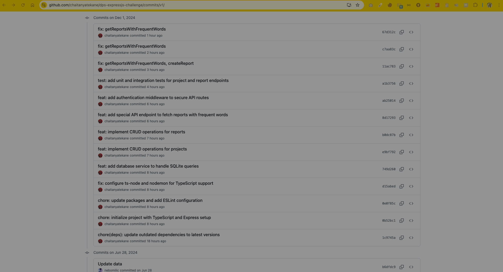

# DPS Backend Coding Challenge

## Overview

This repository contains the solution to the DPS Backend Coding Challenge, a backend system for managing data about a company's projects and their associated reports. It includes RESTful API endpoints for CRUD operations and additional features such as authentication, JEST testing and a special endpoint for retrieving reports with frequent words.

## Demo

[Watch the demo video](https://youtu.be/ah2hPPjNctY)

[](https://youtu.be/ah2hPPjNctY)

## Environment Setup

To set up and run the application locally:

(1). Prerequisites:

- Node.js: v14.x or later
- npm: v6.x or later

(2). Installation

```
npm install
```

(3). Run the application

```
npm run dev
```

(4). Access the application

The server will run at http://localhost:3000.

## Branching Strategy

- `master`: The main branch containing the final merged code.
- `v1`: A feature branch where all challenge tasks and additional features were implemented in small, incremental commits. After completing all tasks, the v1 branch was merged into master.

## Features Implemented

### REST API Development

Designed and implemented the following endpoints for CRUD operations:

- Projects:

    - `GET /api/projects`: Fetch all projects
    - `POST /api/projects`: Create a new project
    - `PUT /api/projects/:id`: Update a project
    - `DELETE /api/projects/:id`: Delete a project

- Reports:
    - `GET /api/reports`: Fetch all reports
    - `POST /api/reports`: Create a new report
    - `PUT /api/reports/:id`: Update a report
    - `DELETE /api/reports/:id`: Delete a report

### Special API Endpoint

Created a special endpoint to fetch reports containing words that appear at least three times across all reports:

- Endpoint: `GET /api/reports/frequent-words`
- Functionality:
    - Identifies frequently occurring words (case-insensitive).
    - Returns reports containing those words as exact matches.

### Middleware for Authentication

Secured all API routes using a hardcoded authentication token:

- Token: `Password123`
- Middleware: Checks the `Authorization` header
- Usage: [key:`Authorization`, value: `Password123`]

### Testing with JEST

Comprehensive JEST test cases were written to ensure API functionality:

- Validated CRUD operations for projects and reports.
- Verified the logic for the frequent-words endpoint.
- Mocked database queries for isolated testing.

## Testing Setup

(1). Test Framework:

JEST was used as the testing framework.

(2). How to Run Tests:

```
npm test
```

(3). Test Coverage:

- CRUD operations for projects and reports.
- The frequent-words endpoint logic.

## Database schema

- Projects Table:

    - `id`: Primary key
    - `name`: Name of the project
    - `description`: Description of the project

- Reports Table:
    - `id`: Primary key
    - `text`: Report content
    - `project_id`: Foreign key referencing the project

## Commit History

Commit Logs (from v1 Branch)



The complete code and history are available in the repository, including the `master` and `v1` branches.

Excited to work with Digital Product School! 😊
